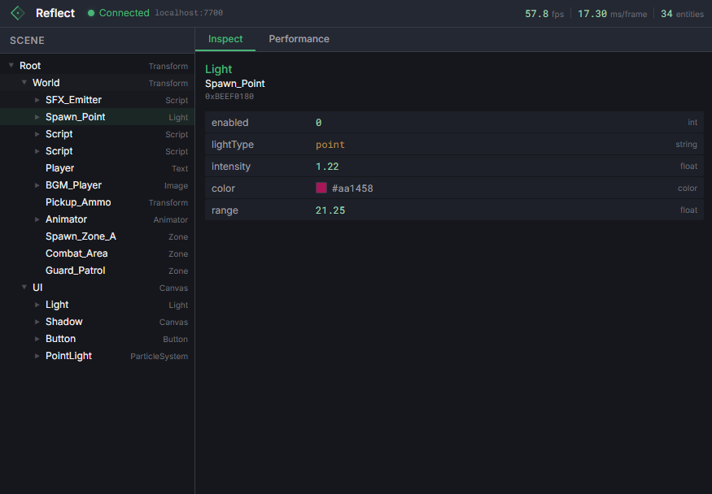

# Reflector

A lightweight web-based scene explorer for C++ game/app projects. Connect to a running application over localhost to inspect the scene hierarchy and monitor performance.

Visual design derived from [Flecs Explorer](https://github.com/flecs-hub/explorer).



## Overview

Reflector has two parts:

### Web UI (`ui/`)
Vue 3 app that connects to the running server and displays a scene tree, entity inspector, and performance graphs.

### C++ library (`lib/`)
Drop-in, stb-style header that embeds an HTTP server in your application. Inherit from `reflector::Server`, implement three virtual methods, done.


## Quick start

### C++ integration

Add `lib/vendor/civetweb/civetweb.c` to your build (compiled as C), then in one `.cpp`:

```cpp
#define REFLECTOR_IMPLEMENTATION
#include "reflector.h"

class MyServer : public reflector::Server {
protected:
    reflector::PerfMetrics onGetPerf() override {
        return { 60.0f, 16.6f, scene.entityCount() };
    }

    std::vector<reflector::SceneNode> onGetScene() override {
        // Return a flat list (the library builds the tree from parentId)
        return {
            { (uintptr_t)&root, 0, "Transform", "Root" },
            { (uintptr_t)&cam,  (uintptr_t)&root, "Camera", "MainCam" },
        };
    }

    std::optional<reflector::EntityInfo> onGetEntity(uintptr_t id) override {
        auto* obj = (GameObject*)id;
        return reflector::EntityInfo{
            id, obj->typeName(), obj->name(),
            {
                reflector::Property::Float("x", obj->pos.x),
                reflector::Property::Float("y", obj->pos.y),
                reflector::Property::Color("tint", obj->colorHex()),
                reflector::Property::Points2D("bounds", obj->getHull()),
            }
        };
    }
};

// In your init:
MyServer server(7700);
server.start();  // non-blocking, runs on background threads

// In your shutdown:
server.stop();
```

Build with CMake:

```
add_subdirectory(reflector/lib)
target_link_libraries(your_game PRIVATE reflector)
```

Or manually: compile `civetweb.c` as C with `-DNO_SSL -DNO_CGI`, compile your `.cpp` as C++17, link with `-lpthread -ldl`.

### Running the UI

```bash
npm install     # from repo root
npm run dev     # starts Vite dev server on :5173, proxies /api to :7700
```

Open `http://localhost:5173` in a browser while your app is running on port 7700.

### Mock server (for UI development)

```bash
npm run server  # starts Express mock on :7700 with generated scene data
```

## REST API

All endpoints return JSON with `Access-Control-Allow-Origin: *`.

| Endpoint | Description |
|---|---|
| `GET /api/perf` | Frame timing and entity count |
| `GET /api/scene` | Full scene hierarchy tree |
| `GET /api/entity/:id` | Entity properties (id is a decimal integer) |

See [mock-server/openapi.yaml](mock-server/openapi.yaml) for the full spec.

### Property types

| Type | Value | UI rendering |
|---|---|---|
| `float` | `1.5` | Green number |
| `int` | `1` | Green number |
| `string` | `"player"` | Orange text |
| `color` | `"#FF5733"` | Hex string + color swatch |
| `points2d` | `[[0,0],[10,0],[10,5]]` | Point count + polygon preview canvas |

## Project structure

```
reflector/
├── lib/
│   ├── reflector.h            # C++ library (stb-style header)
│   ├── CMakeLists.txt         # Optional CMake build
│   ├── example.cpp            # Minimal working example
│   └── vendor/
│       ├── civetweb/          # CivetWeb HTTP server (MIT)
│       └── nlohmann/          # nlohmann/json (MIT)
├── mock-server/
│   ├── index.js               # Express mock API with generated data
│   └── openapi.yaml           # API specification
├── ui/
│   └── src/
│       ├── App.vue            # Layout shell
│       ├── api.js             # Connection polling + fetch helpers
│       └── components/
│           ├── TopBar.vue
│           ├── SceneTree.vue
│           ├── InspectPanel.vue
│           ├── PerformancePanel.vue
│           ├── FrameTimeGraph.vue
│           └── PointsPreview.vue
├── package.json               # npm workspace root
└── LICENSE
```

## Acknowledgements

- Visual design (color palette, layout, typography) derived from [Flecs Explorer](https://github.com/flecs-hub/explorer) (MIT)
- HTTP server: [CivetWeb](https://github.com/civetweb/civetweb) (MIT)
- JSON: [nlohmann/json](https://github.com/nlohmann/json) (MIT)

## License

MIT
